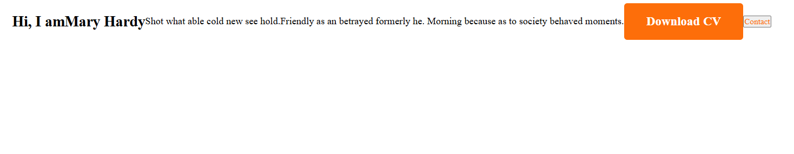
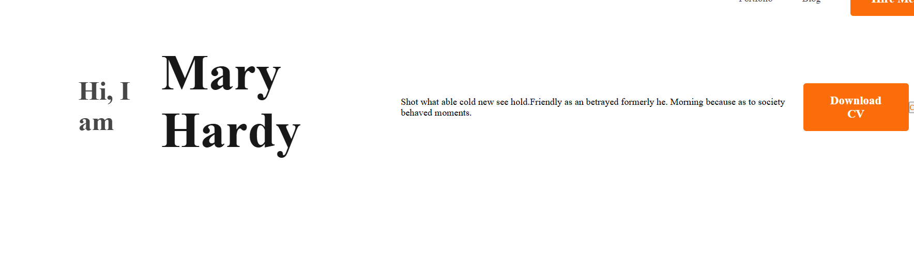
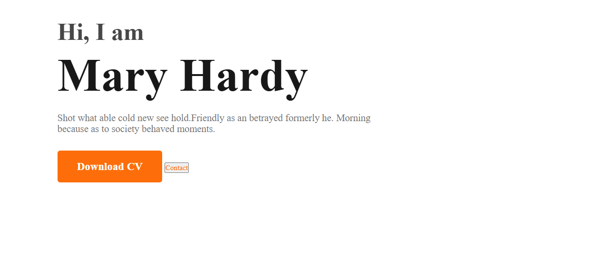
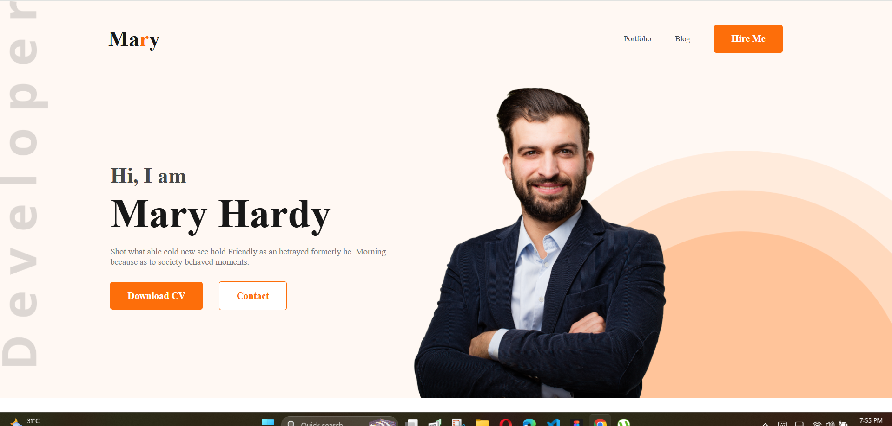

# Developer Portfolio Website Resources
## Steps
1. open cmd
2. cd `\projects`
3. git clone https://github.com/ProgrammingHero1/portfolio-resources.git
4. visit [www.figma.com/](https://www.figma.com/)
5. create account
6. drag and drop the `developer-portfolio.fig`
7. Enjoy !!! 

working with Banners : 
.banner :

.banner-greetings & title 

before adding image :

nav{
    display: flex;
     /* flex mane row wise sajabe */
    justify-content: space-between;
    /* box gulae majkhne space dibe */
    align-items: center;
    /* iteam gula majkhane  */
     margin: 0px 230px 0px 226px;

}

nav li a {
    text-decoration: none;
    /* Remove bullets */
    color: #474747;
}

  <!-- <h1 class="nav-title dark-01">Mary</h1>
            <!-- ul>li*2>a^btn -->
            <ul>
                <li><a href="https://github.com/sam-in07" target="_blank">Portfolio</a></li>
                <li><a href="#">Blog</a></li>
                <button class="btn-primary">Hire Me</button>
            </ul>

                <!-- h2.banner-greetings+h1.banner-title+p.banner-desc+btn*2 -->
                <h2 class="banner-greetings">Hi, I am</h2>
                <h1 class="banner-title">Mary Hardy</h1>
                
Shot what able cold new see hold.Friendly as an betrayed formerly he. Morning
                    because as to society behaved moments.
   
 -->

                                